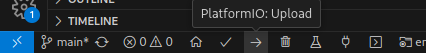

# ESP32 HTTP example
## Get the code
Git clone to directory of choice.


## Developing on local host
> **NOTE:**
> the faster option... for now

The following extensions can be installed in your local vscode instance to start developing outside of a devcontainer.

If you want to avoid manual configuration when updates are made to settings/extensions, see [Developing in a dev container](#developing-in-dev-container)

### Installing and configuring the development tools
1. Install [VSCode](https://code.visualstudio.com/download) on host.
2. Install the following extensions in vscode.
    ```bash
    code --install-extension platformio.platformio-ide \
        --install-extension ms-vscode.cpptools
    ```

## Developing in dev container
> **NOTE:**
> (initially slower, but should be better long term... still need to sort out github credential guidance)

Running a devcontainer avoids manually installing and configuring the extensions necessary to develop for embedded devices.
As extensions are added or re-configured and those changes are pushed to the main branch in github, when the main branch is fetched and the dev container started, a new container with updated extensions and configuration will be built.

This helps to provide a consistent development experience across development machines.

If devcontainers don't work or you prefer to develop directly on the host, see [Developing on local host](#developing-on-local-host).

### Installing and configuring the development tools
1. Install [Docker](https://www.docker.com/get-started/) on host: See docker install documentation for your OS of choice. [Linux install](https://docs.docker.com/desktop/install/linux-install/)
2. User is added to the appropriate groups to control docker. For Linux, run command `usermod -aG docker ${USER}`. Reboot may be required after.
3. Install [VSCode](https://code.visualstudio.com/download) on host.
4. Install "devcontainer" extension in vscode `code --install-extension ms-vscode-remote.remote-containers`.

### Start the dev container
1. Open the project folder in VSCode. In bash navigate to the folder what is the root of the project (where is the README.md) and run `code .`.
2. With the devcontainer extension installed, clicking on the devcontainer button in lower left corner of vscode should open menu at top of screen where you can choose to "Open in a dev container".
3. After some time, vscode should reload and start initializing the PlatformIO extension.
4. Once PlatformIO is initialized, it should prompt to reload vscode.  Reload vscode.
5. Subsequent runs of the container will be much faster once the container is built, unless changes have been pushed to github to update the container or extensions, and those changes have been fetched.

## Configuring sensitive information such as WIFI secrets
C `#define` directives are used to provide sensitive information such as WIFI secrets to the image without hard coding them into code and risking committing them to a public location.

In C, a `#define` directive defines a constant value that can be referenced elsewhere in the code to substitute the reference for the defined value.  For example:
```c
// define a constant called ARRAY_SIZE and give it a value of 5. 
// Note it does not end in a semicolon.  
// That is becaues the value of 5 will be literally substituted anywhere the "ARRAY_SIZE" constant
// is referenced and therefore the semicolon might not make sense in the context of the substitution.
#define ARRAY_SIZE 5

// Define an array of size ARRAY_SIZE.  5 is substituted.
int numberArray[ARRAY_SIZE];

// Initialize each element of the array to 0. Iterate while counter is less than ARRAY_SIZE. 5 is substituted.
for (int i = 0; i < ARRAY_SIZE; i ++) {
    numberArray[i] = 0;
}
```

In the context of secrets, defining the value directly in the code would be leaking sensitive data.
```c
// define the secret constants
#define WIFI_PASSWORD "mywifipassword"
#define WIFI_SSID "mywifissid"

// reference the secrets when connecting to wifi.
WIFI.connect(WIFI_SSID, WIFI_PASSWORD);
```

To prevent leaking the sensitive information directly in code, we can provide the sensitive information as defines during build time by passing define arguments `-D` with the key and value to define. These are specified in the `platformio.ini`. For example:
```ini
[env:esp32doit-devkit-v1]
platform = espressif32
; ... snip other configuration
build_flags =
    -DWIFI_SSID="mywifissid"
    -DWIFI_PASSWORD="mywifipassword"
``` 

And then reference those defines in code
```c
// no longer need to directly define the constants

// reference the secrets defined via build arguments when connecting to wifi.
WIFI.connect(WIFI_SSID, WIFI_PASSWORd);
```

Since the `platformio.ini` is also committed to source control, there is one last change we need to make to avoid exposing sensitive information. The `platformio.ini` file should reference (environment variables)[https://docs.platformio.org/en/latest/projectconf/interpolation.html] to get the secrets.

> **Info**
> The secret must be wrapped in double quotes to successfully substitute into the code. Thus the escaped quotes around the sysenv values.

```ini
[env:esp32doit-devkit-v1]
platform = espressif32
; ... snip other configuration
build_flags =
    -DWIFI_SSID=\"${sysenv.WIFI_SSID}\"
    -DWIFI_PASSWORD=\"${sysenv.WIFI_PASSWORD}\"
```

Then add the environment variables to the VSCode terminal settings for the **user** so build process will pick them up.
> **Warning**  
> Do not add these environment variables to workspace settings.  That will get committed to source control.
1. Click Cog in lower left -> Settings
2. Search for env  
      
3. Click edit in settings.json
4. Add your environment variables
    ```json
    {
        "terminal.integrated.env.linux": {
            "WIFI_SSID": "myssid",
            "WIFI_PASSWORD": "mypassword"
        }
    }
    ```


## Building the code
Click the little checkmark in the footer toolbar to build the code.


## Uploading the code to the device
Similar to build, just click the right facing arrow.



If you have issues uploading the firmware to the device, there are a couple things to check.
1. Make sure the device was properly enumerated by the OS. In Linux, you can check this by running the script found in the /scripts folder of this project.  Run `./scripts/device_enumeration.sh`.  This **may** also work in linux subsystem in windows... but you may be venturing into the land of dragons at that point.
2. Make sure you have the right [driver installed for windows](https://docs.espressif.com/projects/esp-idf/en/v4.3-beta2/esp32s2/api-guides/dfu.html#usb-drivers-windows-only) or try setting up the [udev rules for linux](https://docs.espressif.com/projects/esp-idf/en/v4.3-beta2/esp32s2/api-guides/dfu.html#usb-drivers-windows-only). 
3. If all else fails, message me.  It may be that we just need to add your current user to the appropriate group (e.g. `dialout`) in order to have permission to upload the firmware to the device. This gets wonky because `dialout` group is used for opensuse, but other linux distros may use a different group name and number. As for windows, you'd be better off asking me to explaining how to play candyland... with dice... yeah it makes that much sense to me. Good luck to you for windows.

## Connecting to serial output of the device
To get any information logged on the device, you will need to connect to the serial device over usb.  After uploading the image, there is another toolbar button to connect via serial monitor. The baud rate of the monitor must match the baud rate of the device. Typically you want `115200` for baud rate. This is configured in the `platformio.ini`.


Click the plug icon in the toolbar to start the serial monitor.  You should see legible output after a moment if you logged anything.


Output


If you get gibberish, then your baud rate is incorrect.


## Installing additional libraries
//TODO

## Configuring the project
The `platformio.ini` file is where build configuration information is stored.  This informatin includes:
1. What board (doit devkit)
2. What framework to use (Arduino or ESPIDF)
3. Overrides for board configuration (change clock frequency or flash size)

https://docs.platformio.org/en/latest/projectconf/sections/env/index.html

## Bootstrapping a new project
This project was designed jump right into development.  You can always fork this repo to use as a base for another project.

If you want, thouhg, here is a link to platform IO documentation for starting a new project.
https://docs.platformio.org/en/latest/integration/ide/vscode.html#quick-start
